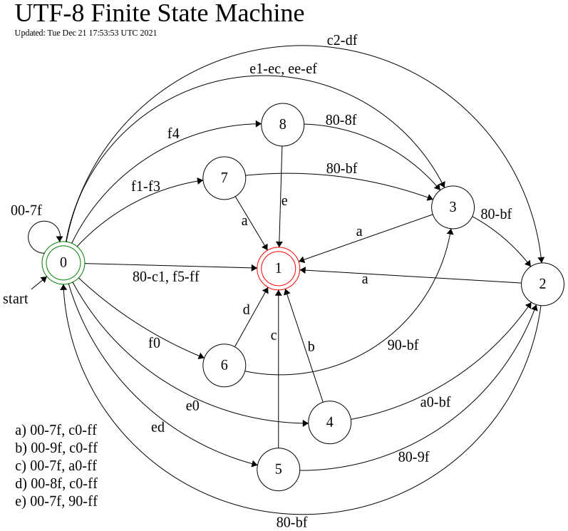

# Utf8tests

This project is about testing UTF-8 decoders and validators. It
provides tests cases you can use to test your application and it has
useful information about UTF-8 and where to find more information.

There is a reference implementation of an UTF-8 decoder.

There is a table at the bottom with test results for some common
applications.

## Test Cases

You can find the source code for test cases in the utf8test.txt
file. This file gets compiled to utf8tests.bin and
utf8browsertests.txt which you use for your testing.

* utf8tests.txt -- test cases; the source code for the next two files
* utf8test.bin -- a binary file containing valid and invalid UTF-8 byte sequences
* utf8browsertests.txt -- a file for visually testing browsers

We are testing an application's UTF-8 reading and writing by sending
the utf8test.bin text file through it then checking the resulting
file.

~~~
             read       write               read
utf8test.bin —--> (app) —---> artifact file --—> (utf8tests app)
~~~

You can visually test the reading part with the utf8browerstest.txt
file.  It contains the tests numbered 36.x from the test cases file.

~~~
                    read
utf8browerstest.txt --—> (app)
~~~

# Test Groups

The test file groups the tests into these categories:

* Valid Characters
* Too Big Characters
* Overlong Characters
* Surrogate Characters
* Valid Noncharacters
* Miscellaneous Byte Sequences
* Browser Tests
* Null Characters

## Test Your Decoder

You can run the utf8tests.bin file through your decoder then check its
output against the expected output shown in the utf8test.txt file. You
can do this automatically by passing your artifact file to utf8tests
command line app.

We show you how to do this using iconv as an example.  The iconv
command line application converts between different encoding. For our
example you convert from UTF-8 to UTF-8.

__Generate an Artifact__:

You tell iconv to read the utf8test.bin file and write it to an
artifacts file called utf8.skip.icon.txt. The -c option tells iconv to
skip invalid byte sequences.

~~~
iconv -c -f UTF-8 -t UTF-8 utf8tests.bin >artifacts/utf8.skip.icon.txt
~~~

Note: you can find many artifact files from different applications in the
artifacts folder.

__Evaluate the Artifact__:

You then pass the artifact file you created to the utf8test
application and it will run all the test cases. The results go to the
screen. In the example we view the output in less:

~~~
bin/utf8tests -e=utf8tests.txt --skip=artifacts/utf8.skip.iconv.1.11.txt | less
~~~

In my version of iconv, it allows characters bigger than the maximum and
it allows surrogates. Here is a sample of the output:

~~~
6.0: invalid test case: f7 bf bf bf
6.0:          expected: nothing
6.0:               got: f7 bf bf bf

6.0.1: invalid test case: f4 90 80 80
6.0.1:          expected: nothing
6.0.1:               got: f4 90 80 80

6.1: invalid test case: f8 88 80 80 80
6.1:          expected: nothing
6.1:               got: f8 88 80 80 80

6.2: invalid test case: f7 bf bf bf bf
6.2:          expected: nothing
6.2:               got: f7 bf bf bf
...
~~~

The utf8tests.txt file has comments telling what the test does. Below
is the 6.0 test and its comment.  The 6.0 test expects the invalid
byte sequence F7 BF BF BF to produce nothing in the artifact file when
you are skipping. The utf8test.txt file describes the test line format
in detail.

~~~
# too big U+001FFFFF, <F7 BF BF BF>
6.0:invalid hex:F7 BF BF BF:nothing:EFBFBD  EFBFBD  EFBFBD  EFBFBD
~~~

My version of iconv is very old but it is the current version on an
up-to-date mac.

## Reference Decoder

I ported Bjoern Hoehrmann's decoder to Nim for a reference
implementation. You can find it in the src folder in the unicodes.nim
file. Here is Bjoern's web page:

* [Bjoern Hoehrmann Decoder](http://bjoern.hoehrmann.de/utf-8/decoder/dfa/)

## UTF-8 Finite State Machine

I created a state diagram for UTF-8 with an error state inspired by
the diagram created by Bjoern Hoehrmann. You can find the same
information in table 3-7 in the Unicode specification.

I found a editor for creating state diagrams which allows you
to save it as an SVG file. Once you have an SVG file you can tweek it
in a text editor or in inkscape.

* [Finite State Machine Editor](http://madebyevan.com/fsm/) - simple on-line finite state machine editor
* [Unicode 14.0](https://www.unicode.org/versions/Unicode14.0.0/ch03.pdf) -- See Table 3-7. Well-Formed UTF-8 Byte Sequences

## UTF-8 General Information

Important UTF-8 facts for testing:

* Code points must be in the range U+0000 to U+10FFFF.
* A UTF-8 code point is encoded with 1 to 4 bytes.
* Some byte sequences are invalid.
* One byte UTF-8 characters are ASCII characters, 0 - 7f.
* The surrogate characters are not valid in UTF-8.

## Bit Patterns

Below we show the bit patterns for 1 to 4 byte UTF-8 code point
sequences. The one byte characters all have the high bit 0.

~~~
0xxxxxxx
110xxxxx 10xxxxxx
1110xxxx 10xxxxxx 10xxxxxx
11110xxx 10xxxxxx 10xxxxxx 10xxxxxx
~~~

Binary to hex table:

~~~
0000 0   1000 8
0001 1   1001 9
0010 2   1010 a
0011 3   1011 b
0100 4   1100 c
0101 5   1101 d
0110 6   1110 e
0111 7   1111 f
~~~

## Noncharacters

The "noncharacters" in the Unicode specification are easy to
misunderstand. The following chart shows that noncharacters are really
characters. They are characters with special properties.

* B -- is the full set of bits patterns for 32 bits or four bytes. Visually it is every
  path through the finite state machine. C + not C = B.
* C -- is defined by table 3.7 and visually by the finite state machine
  for paths that terminate at state 0. These are called code points or
  unicode characters.  Each code point has a hex value. The range is
  U+0000 to U+10FFFF.
* n -- "noncharacters" is part of C.
* not C -- terminates at state 1. These are the invalid byte sequences.

## Invalid Byte Sequences

When you are reading an UTF-8 encoded file you need to determine how to
handle the invalid byte sequences. You could replace them with the
replacement character U+FFFD, &lt;EF BF BD&gt; for this purpose.

You have flexiblity how you do the replacement and it will conform to
the spec. However, it is recommended that you do it in a particular
way. The test cases in this project test for the standard way which is
called "Maximal Subpart" in the spec.

The Unicode specification says:

   >An increasing number of implementations are adopting the handling of
   >ill-formed subsequences as specified in the W3C standard for encoding
   >to achieve consistent U+FFFD replacements.

See:

* [Unicode 14.0](https://www.unicode.org/versions/Unicode14.0.0/ch03.pdf) -- Unicode 14.0 Specification -- Conformance page 126, section 3.9.
* [w3.org Encoding](http://www.w3.org/TR/encoding/) -- w3.org encoding

## Other UTF-8 Information

Wikipedia has a good explanation of UTF-8:

* [Wikipedia UTF-8](https://en.wikipedia.org/wiki/UTF-8) -- UTF-8 is a variable-width character encoding used for electronic communication...

You can look up unicode characters by code point:

* [Unicode Charts](https://unicode.org/charts/) -- Unicode 14.0 Character Code Charts

You can convert from code point to UTF-8 hex byte sequences and
visa-versa using an online app:

* [Code Point <-> UTF-8 byte sequence](https://www.cogsci.ed.ac.uk/~richard/utf-8.cgi) -- Online UTF-8 converter

Many test cases in utf8tests.txt were inspired by Markus Kuhn tests. See:

* [Markus Kuhn UTF-8 Tests](https://www.cl.cam.ac.uk/~mgk25/ucs/examples/UTF-8-test.txt) -- UTF-8 decoder capability and stress test

## Results

I tested a few languages, editors and browsers on my Mac. Each
language was tested in one or two ways, either skipping invalid byte
sequences or replacing them with the replacement character.  NA means
it is not supported by the language.

| Code  | Skip | Replace |
| ----- | ---- | ------- |
| Chrome 97.0.4692.71 | NA | ✅ passv |
| Emacs 25.3.1  | 🛑 fail | NA |
| Firefox 95.0.2 | NA | ✅ passv |
| Iconv 1.11  | 🛑 fail | NA |
| Nim 1.4.8 | 🛑 fail | NA |
| Node js 17.2.0 | NA | ✅ pass |
| Python 3.7.5 | ✅ pass | ✅ pass |
| Perl 5.30.2 | NA | 🛑 fail |
| Reference | ✅ pass | ✅ pass |
| Safari 14.1.2 | NA | ✅ passv |

* v - tested visually with utf8browsertests.txt

See the procedure page for the steps to reproduce the results shown in
the table.

* [Procedures](procedures.md) &mdash; steps to reproduce the table results.

## Contribute

You can contribute to this project by writing a command line app in
your favorite language and adding it to the writers directory.

The app reads a binary file, encodes the bytes as UTF-8, then writes
it to a new file. It takes three command line parameters: the input
file name the output file name and the word “skip” or “replace”.

Or you can run the utf8tests.bin file through your decoder and post
the resulting file to the artifacts directory.

If you find a bug or something is wrong, please file an issue.
